# 论坛系统测试报告

## 一、项目简介

本项目是一款网络在线论坛平台，旨在为用户搭建一个开放的交流与学习社区。平台支持用户完成账号注册、登录等基础操作，同时提供发布原创帖子、回复他人内容、点赞互动、查看收到的互动回复等核心功能，满足用户分享观点、探讨问题、互相学习的需求。此外，系统还配备板块分类、日夜主题切换、站内信、个人资料管理等模块，助力用户打造个性化的论坛社交形象。系统界面美观、使用简便、功能齐全。

本次测试采用**手工测试与 UI 自动化测试相结合**的方式：功能场景以 Selenium 自动化用例（Python 编写）批量执行、断言验证，安全与兼容性以探索性手工测试补充。

## 二、测试计划

### 1. 测试环境与用例设计

**测试环境**（自动化启动时自动打印并记录）：

| 项目 | 版本/说明 |
|------|-----------|
| 操作系统 | Windows 11（Build 22631） |
| Python | 3.10.20（Anaconda env: test） |
| 浏览器 | Chrome 151.0.7922.174 |
| 驱动 | chromedriver 151.0.7922.138（webdriver-manager 自动匹配） |
| 依赖 | selenium 4.0.0 / webdriver-manager 4.1.2 / PyMySQL 1.2.0（见 requirements.txt） |
| 被测系统 | 论坛系统 http://127.0.0.1:58080，单页应用（SPA，详情页/发帖页/我的帖子/个人中心均为 index.html 内动态区域，无独立 URL） |
| 数据库 | MySQL（forum_db） |

**用例设计方法**：注册模块采用正交试验法（allpairs 思想，用最少组合覆盖用户名/昵称/密码/确认密码/条款五个输入项的填写与不填写组合）；其余模块综合运用等价类划分、边界值分析、场景法（业务流程闭环）、状态迁移法（点赞计数、登录态）。

**用例规模**（与 tests/ 代码及 RunTest.py 一一对应）：

| 模块 | 测试文件 | 用例数 | 结果 |
|------|----------|:------:|:----:|
| 注册 | ForumSignup.py | 4 | 通过 |
| 登录 | ForumLogin.py | 3 | 通过 |
| 论坛首页 | ForumIndex.py | 8（另 1 条暂缓） | 通过 |
| 个人中心 | PersonalCenter.py | 5 | 通过 |
| 发布/编辑帖子 | Posting.py | 5 | 通过 |
| 帖子详情页 | PostDetailsPage.py | 9 | 通过 |
| 我的帖子 | MyPost.py | 6 | 通过 |
| 安全测试 | Security.py | 2 | 通过 |
| **合计** | | **42** | **42 通过 / 0 失败** |

> 📷 用例设计图：测试用例.xmind（可编辑源文件）/ 论坛系统自动化测试用例.png（预览图）；执行证据截图由框架自动归档：按次留存于 `images/<日期>/第N次测试/`（方法名-时间戳.png），同时刷新固定副本 `images/latest/类名_方法名.png`（每次运行覆盖），本报告各场景引用的即 latest 目录——**每次跑完 RunTest.py 报告图片自动更新为最新证据**。

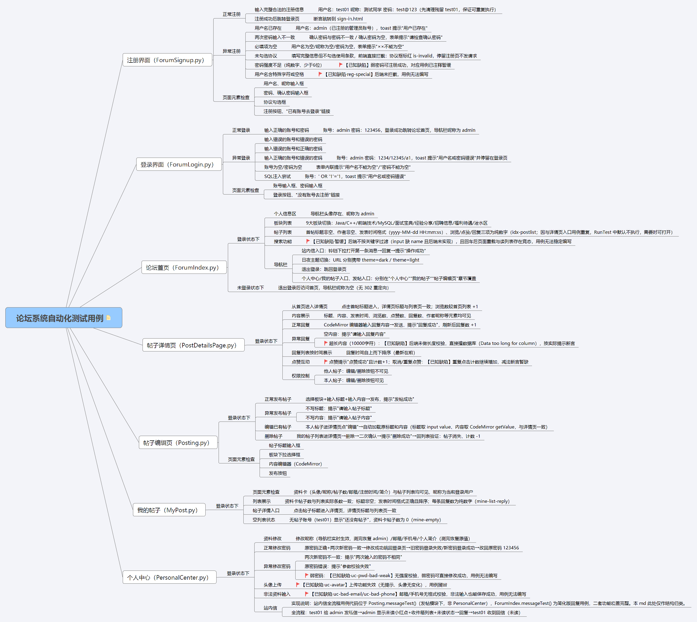

### 2. 功能测试

#### 2.1 注册界面

```
测试场景一：五个输入项全部正确填写并勾选条款
```
> 预期结果：注册成功，跳转登录页 sign-in.html
> 实际结果：注册成功并跳转登录页（测试账号 test01，每次运行前自动清理残留，保证可重复执行）


```
测试场景二：用户名填写已存在的 admin
```
> 预期结果：注册失败，弹窗提示"用户已存在"
> 实际结果：弹窗提示"用户已存在"，停留注册页

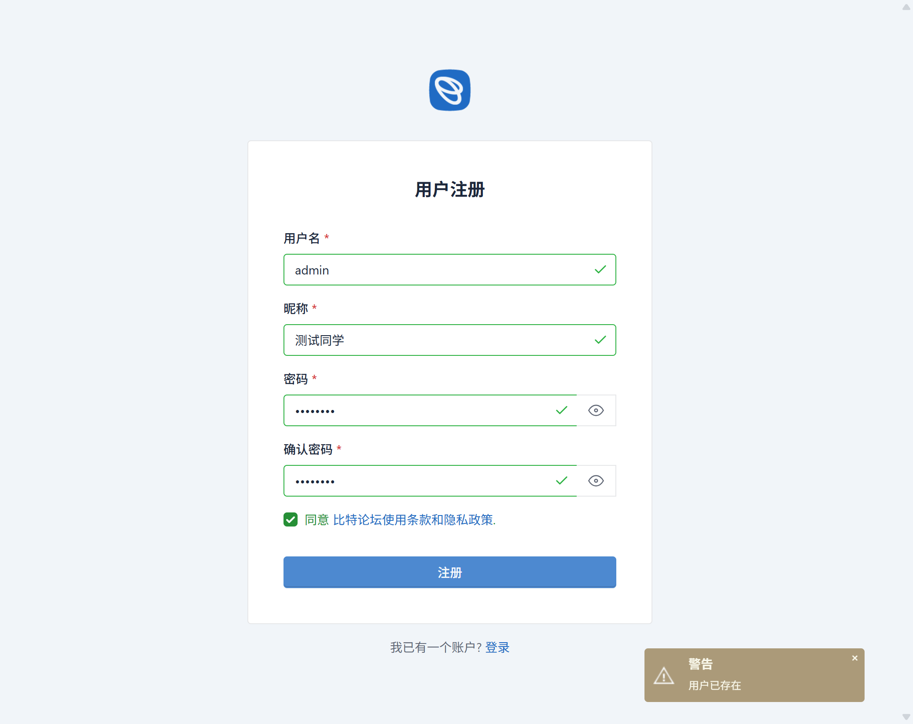

```
测试场景三：两次密码输入不一致 / 确认密码为空
```
> 预期结果：注册失败，确认密码输入框标红，提示"请检查确认密码"
> 实际结果：输入框标红并提示"请检查确认密码"

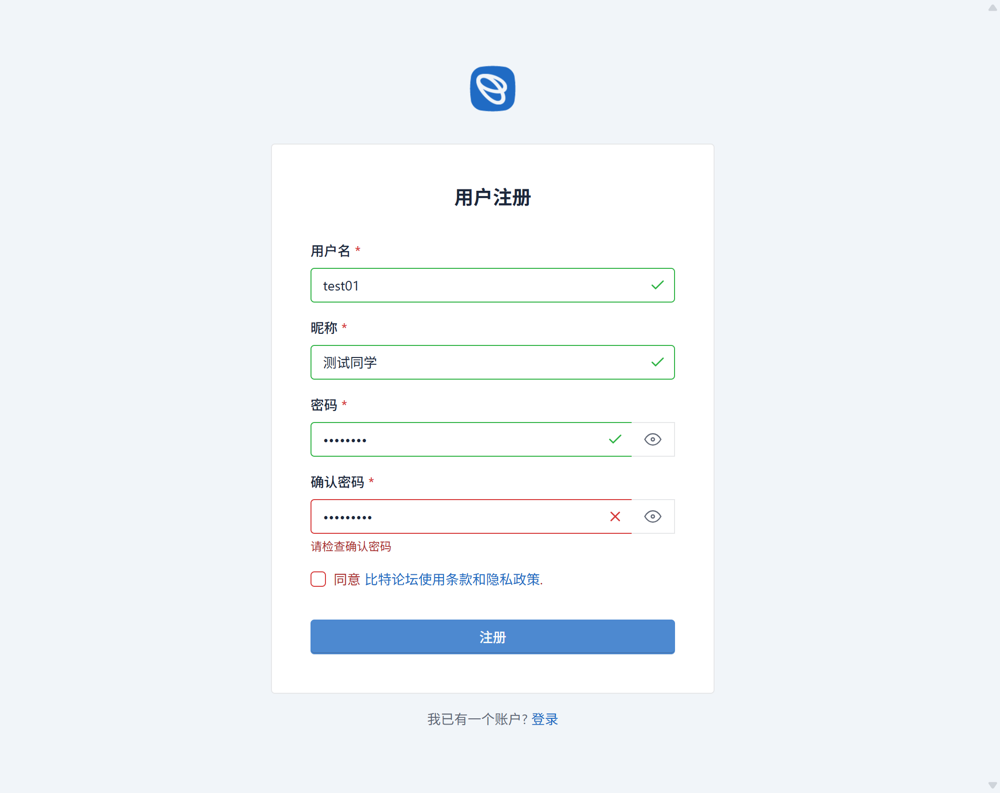

```
测试场景四：用户名/昵称/密码任一必填项为空
```
> 预期结果：注册失败，对应输入框变为红色，下方提示"××不能为空"
> 实际结果：输入框标红并提示"用户名不能为空/密码不能为空"等

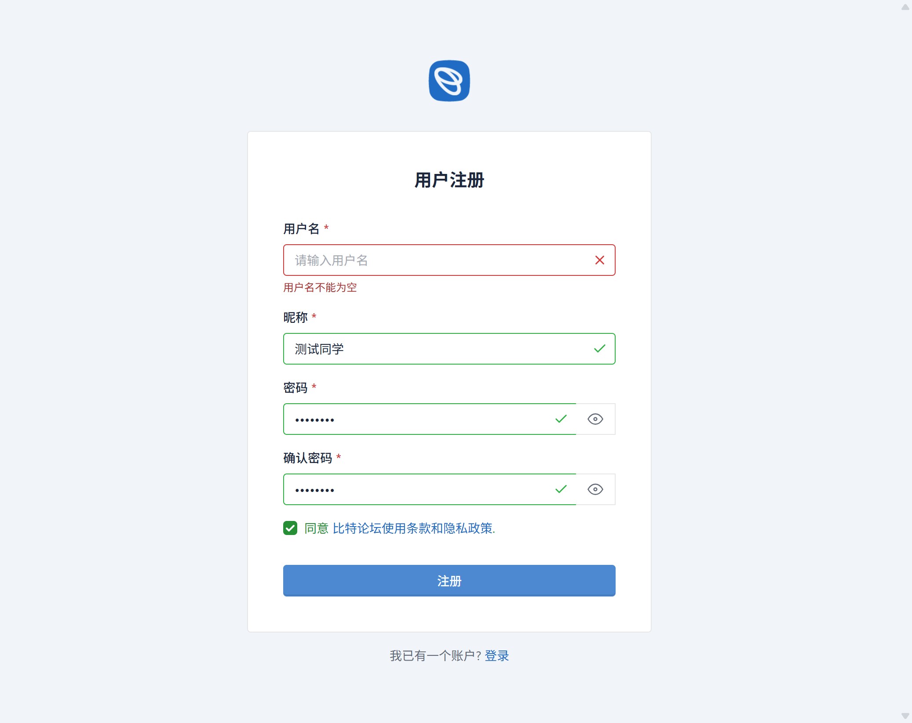

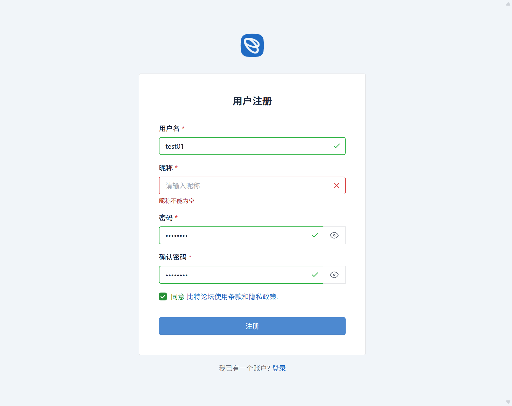

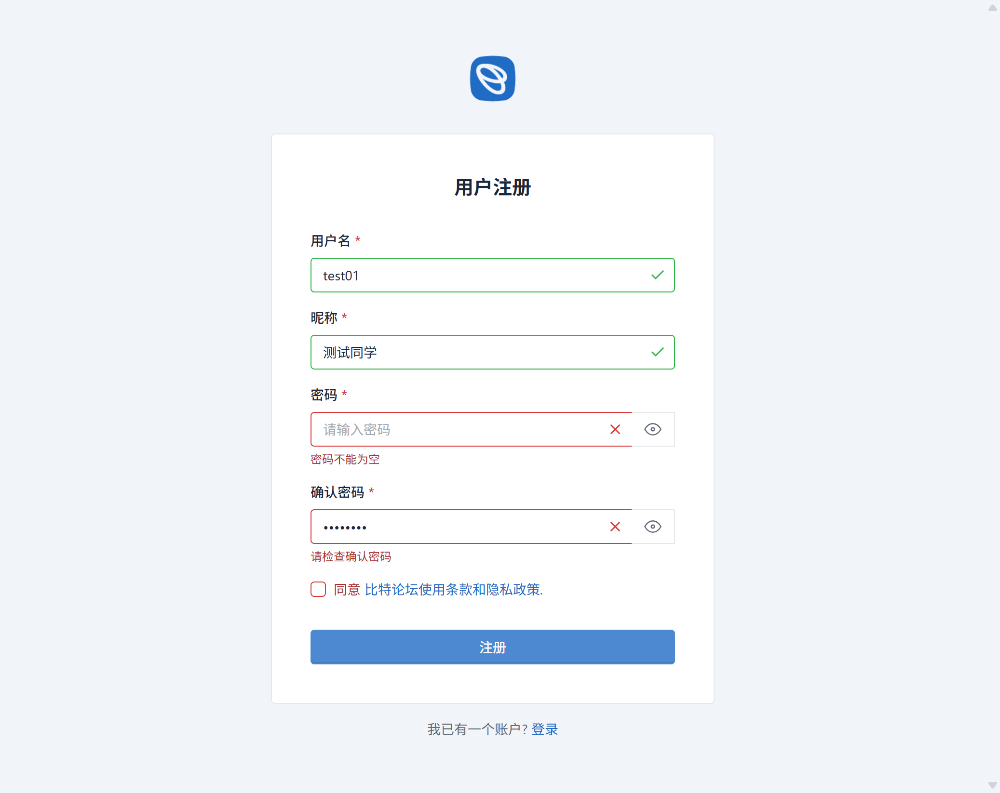


```
测试场景五：信息填写完整但不勾选使用条款
```
> 预期结果：注册失败，条款勾选框标红并提示，前端直接拦截不发请求
> 实际结果：条款框标红（form-check-input is-invalid），停留注册页，网络请求未发出

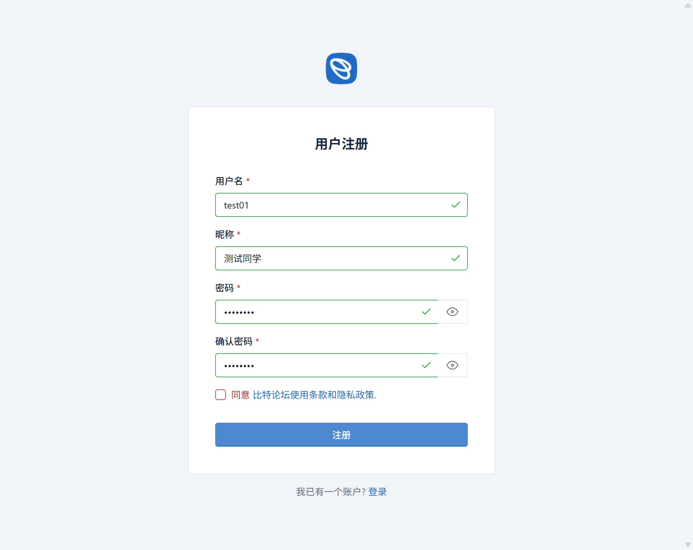

```
测试场景六：弱密码（纯数字 123456、少于 6 位）
```
> 预期结果：注册失败，提示密码强度不足
> 实际结果：**【Bug】注册成功，系统无密码强度校验**（对应用例已注释暂缓）

```
测试场景七：用户名含空格或特殊字符
```
> 预期结果：注册失败，提示用户名格式不合法
> 实际结果：**【Bug】注册成功，后端未拦截特殊字符**

#### 2.2 登录界面

```
测试场景一：正确用户名 + 不填密码
```
> 预期结果：密码输入框变红，下方提示不能为空
> 实际结果：提示"密码不能为空"


```
测试场景二：用户名、密码都不填
```
> 预期结果：两个输入框都变红，提示不能为空
> 实际结果：提示"用户名不能为空/密码不能为空"


```
测试场景三：不填用户名 + 填密码
```
> 预期结果：用户名输入框变红，提示不能为空
> 实际结果：提示"用户名不能为空"


```
测试场景四/五/六：错误用户名+正确密码、正确用户名+错误密码、双错
```
> 预期结果：弹出警告"用户名或密码错误"，停留登录页
> 实际结果：均弹窗"警告 | 用户名或密码错误"，停留登录页


```
测试场景七：正确用户名 + 正确密码（admin/123456）
```
> 预期结果：登录成功，进入论坛主页，导航栏显示昵称 admin
> 实际结果：成功进入主页，导航栏昵称为 admin

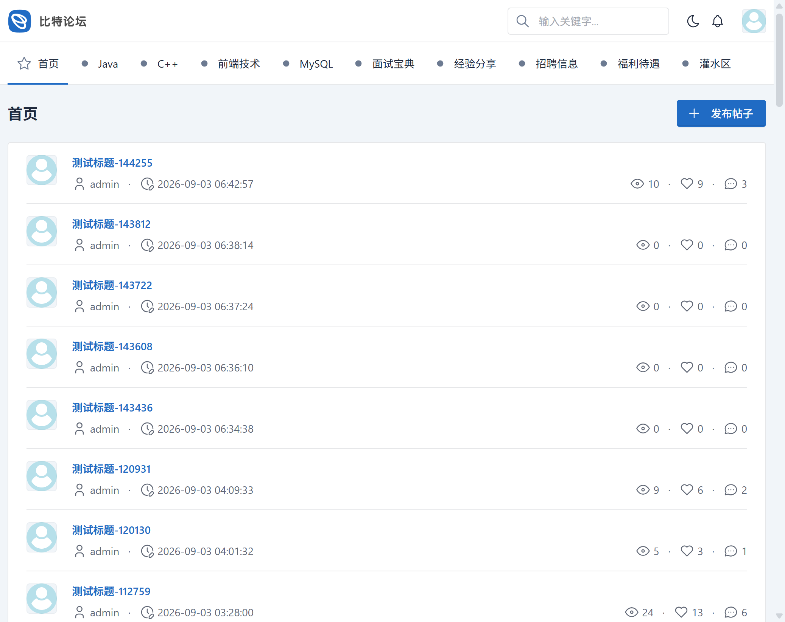

#### 2.3 论坛首页

```
测试场景一：依次点击 9 大板块（Java/C++/前端技术/MySQL/面试宝典/经验分享/招聘信息/福利待遇/灌水区）
```
> 预期结果：板块正常切换，标题与板块一致，帖子正常显示
> 实际结果：9 个板块逐一切换，标题断言全部一致（板块N切换: 预期[xxx] 实际[xxx]）

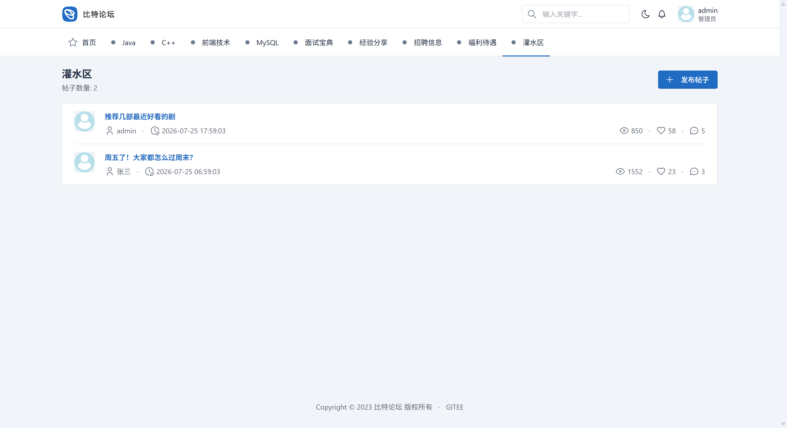

```
测试场景二：帖子列表内容断言
```
> 预期结果：首帖标题、作者非空，发表时间格式 yyyy-MM-dd HH:mm:ss，浏览/点赞/回复数为纯数字
> 实际结果：首帖"推荐几部最近好看的剧"、作者 admin、时间 2026-07-25 17:59:03、浏览 850 / 点赞 58 / 回复 5，断言全部通过


```
测试场景三：点击月亮/太阳按钮切换日夜主题
```
> 预期结果：页面在白天/黑夜模式间切换
> 实际结果：切换成功，URL 分别携带 theme=dark / theme=light

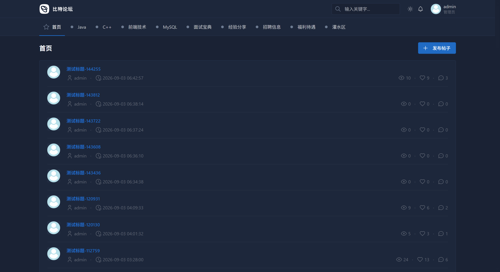

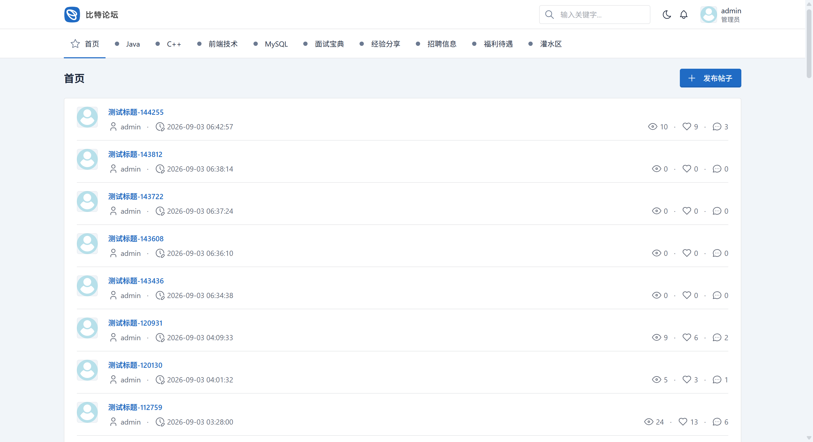

```
测试场景四：点击小铃铛查看并回复站内信
```
> 预期结果：唤起站内信界面，可查看私信并回复成功
> 实际结果：成功打开信件、回复后提示"操作成功"

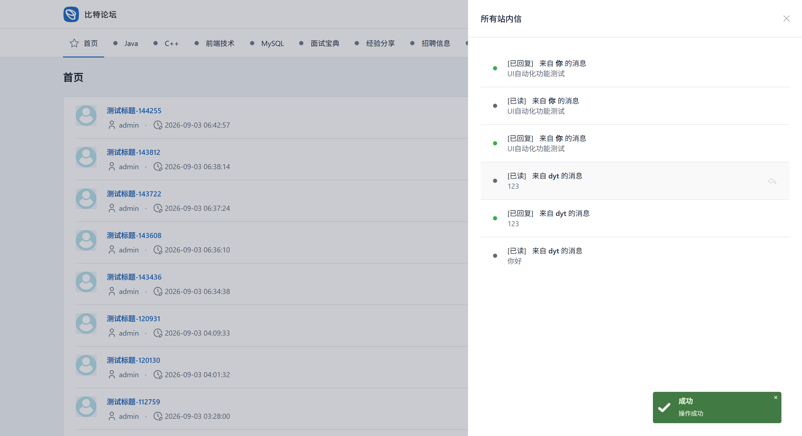

```
测试场景五：点头像弹出菜单（我的帖子/个人中心/退出登录）
```
> 预期结果：弹出下拉菜单，各入口可正常跳转，退出后返回登录页
> 实际结果：菜单正常弹出，"我的帖子""个人中心"正常进入，退出成功跳回 sign-in.html

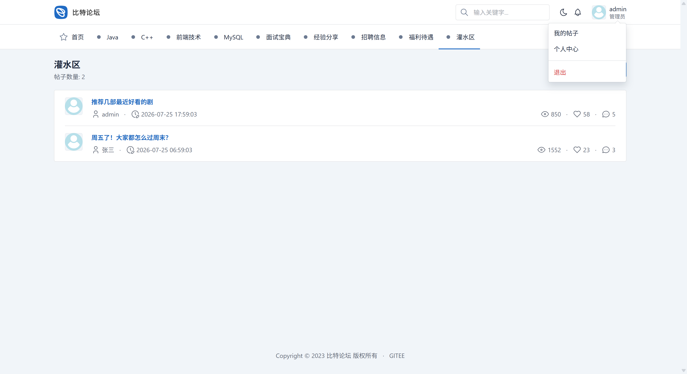


```
测试场景六：退出登录后直接访问首页
```
> 预期结果：导航栏不显示任何用户昵称（单页应用无 302 跳转，不泄露用户信息）
> 实际结果：昵称元素不存在或为空，未泄露登录态

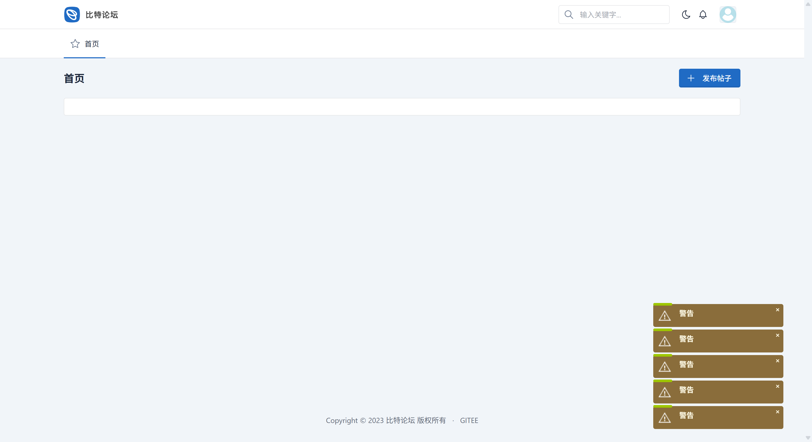

```
测试场景七：在搜索框输入关键词回车
```
> 预期结果：根据关键词搜索并展示相关帖子
> 实际结果：**【Bug】无法搜索**——输入框缺 name 属性、后端未按关键字过滤，且回车后页面重载存在竞态（用例暂缓）

#### 2.4 我的帖子界面

```
测试场景一：从头像菜单进入"我的帖子"
```
> 预期结果：显示资料卡（头像/昵称/发帖数/邮箱/注册时间/简介）与帖子列表，昵称为当前登录用户
> 实际结果：资料卡与列表均可见，昵称正确


```
测试场景二：核对帖子数量
```
> 预期结果：资料卡发帖数与列表实际条数一致，列表回复数为纯数字，时间降序
> 实际结果：条数一致，回复数断言通过，时间格式正确且降序


```
测试场景三：点击帖子标题
```
> 预期结果：进入帖子详情页，标题与列表一致
> 实际结果：成功进入详情页，标题一致


```
测试场景四：无帖子账号（test01）查看我的帖子
```
> 预期结果：列表为空并显示空态提示
> 实际结果：显示"还没有帖子"，资料卡帖子数为 0

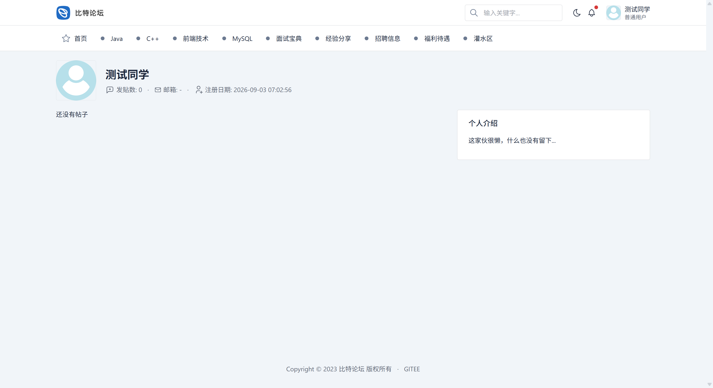

#### 2.5 帖子详情页与互动

```
测试场景一：首页点击首帖进入详情页
```
> 预期结果：详情页标题与列表一致，标题/内容/时间/浏览/点赞/回复数/作者均可见，浏览数 +1
> 实际结果：标题一致，元素齐全，浏览数 首页[37] → 详情页[38]，断言通过


```
测试场景二：正常回复
```
> 预期结果：提示"回复成功"，回复数 +1
> 实际结果：提示"回复成功"，回复数 9 → 10（DOM 实时断言）

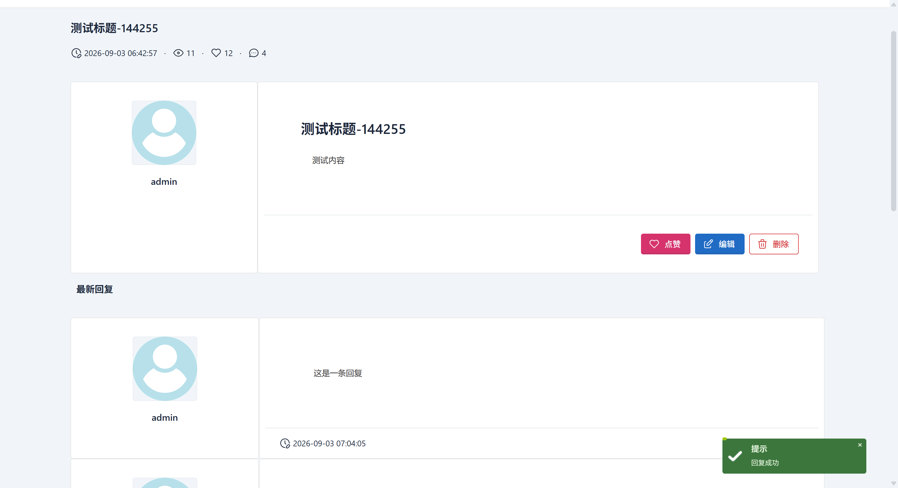

```
测试场景三：回复内容为空直接发送
```
> 预期结果：提示"请输入回复内容"，不产生回复
> 实际结果：提示"请输入回复内容"

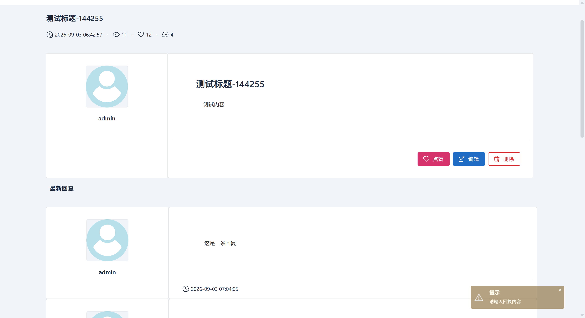

```
测试场景四：回复 10000 字符超长内容
```
> 预期结果：系统拦截并给出友好提示（长度限制）
> 实际结果：**【Bug】后端无长度校验，直接抛出数据库异常 Data truncation: Data too long for column 'content'，原始 SQL 报错回显前端**

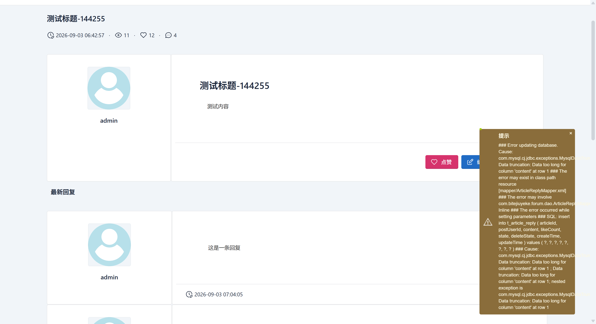

```
测试场景五：核对回复列表顺序
```
> 预期结果：回复按时间降序（最新在前）
> 实际结果：降序排列断言通过

```
测试场景六：点赞 / 重复点击点赞
```
> 预期结果：点赞成功计数 +1，再次点击取消点赞
> 实际结果：首次点赞 +1 成功；**【Bug】重复点击计数继续增加，无法取消点赞（无限刷赞）**

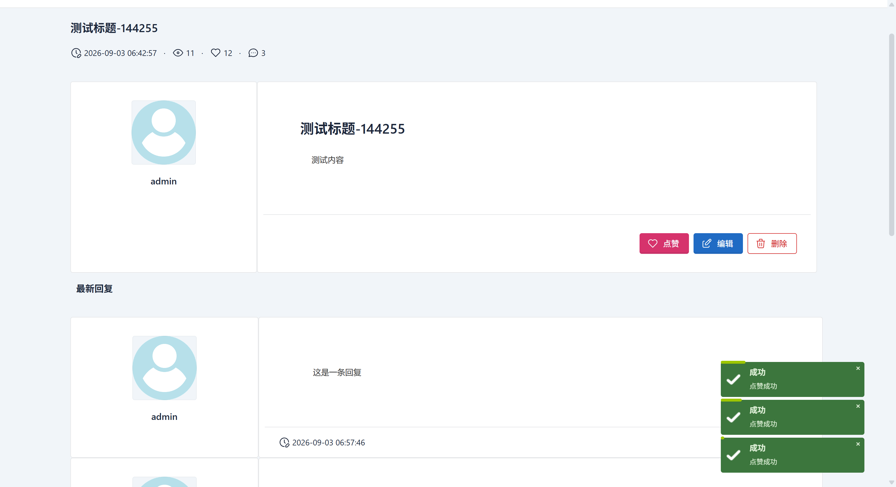

```
测试场景七：权限控制
```
> 预期结果：他人帖子不显示编辑/删除按钮，本人帖子显示
> 实际结果：他人帖子无编辑/删除按钮，本人帖子可见，断言通过

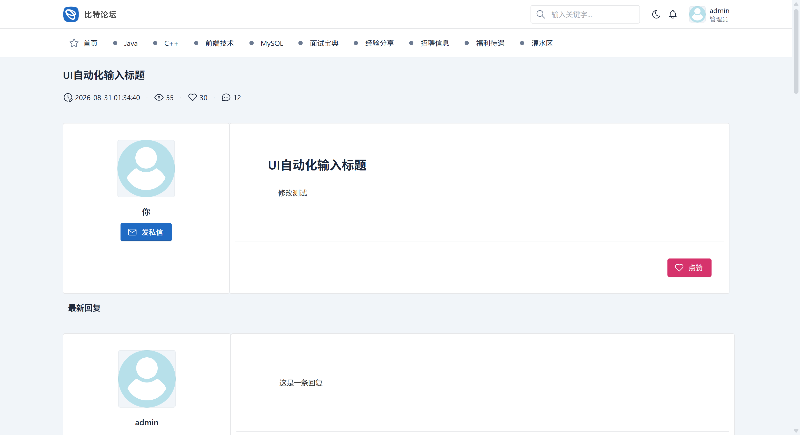

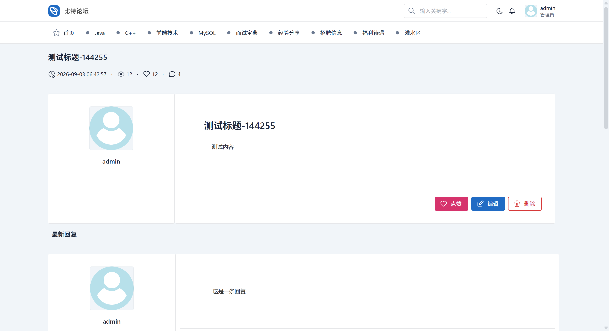

```
测试场景八：本人帖子点击"编辑"
```
> 预期结果：弹出编辑界面并自动加载原标题、原内容
> 实际结果：标题（input value）与内容（Markdown 预览区）均与详情页一致

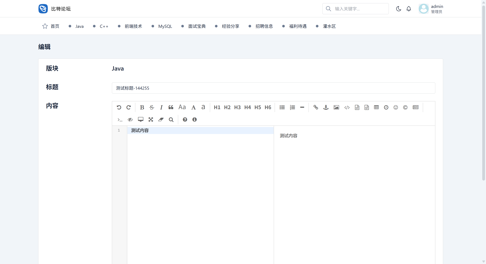

#### 2.6 发布帖子界面

```
测试场景一：填标题不填内容点击发布
```
> 预期结果：发布失败，警告"请输入帖子内容"
> 实际结果：提示"请输入帖子内容"

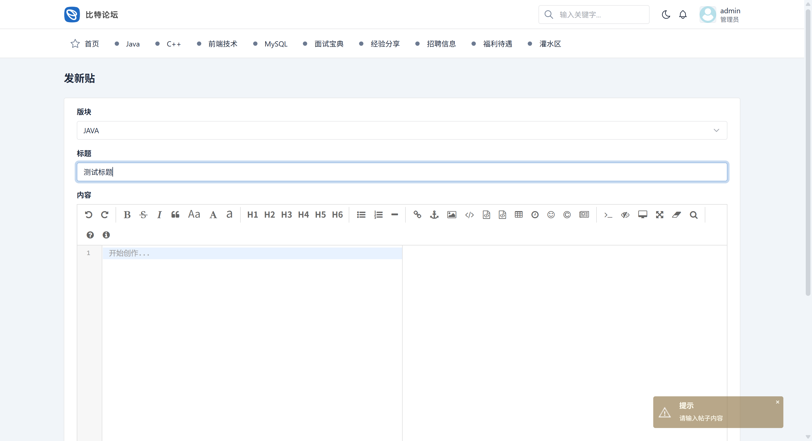

```
测试场景二：填内容不填标题点击发布
```
> 预期结果：发布失败，警告"请输入帖子标题"
> 实际结果：提示"请输入帖子标题"

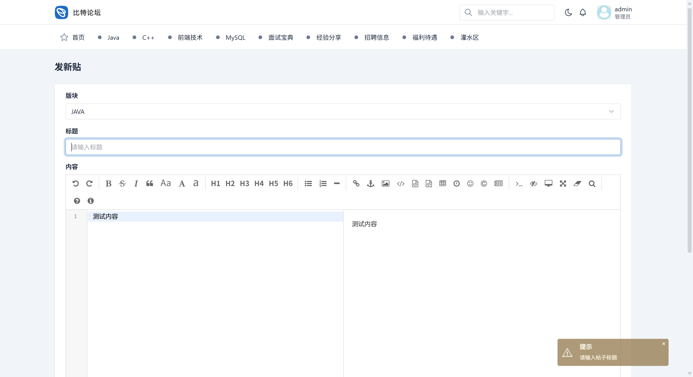

```
测试场景三：标题、内容都不填点击发布
```
> 预期结果：发布失败，同时提示标题、内容不能为空
> 实际结果：被拦截并提示

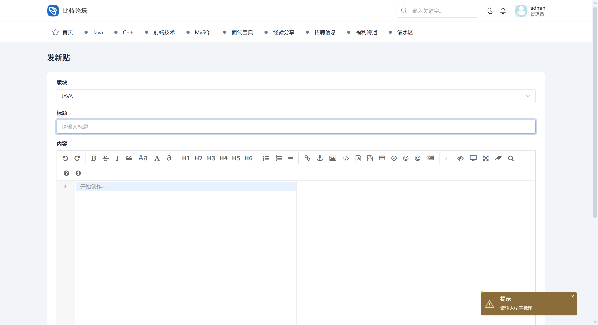

```
测试场景四：完整填写后发布
```
> 预期结果：发布成功并提示（标题带时间戳保证每条用例数据唯一）
> 实际结果：发布成功

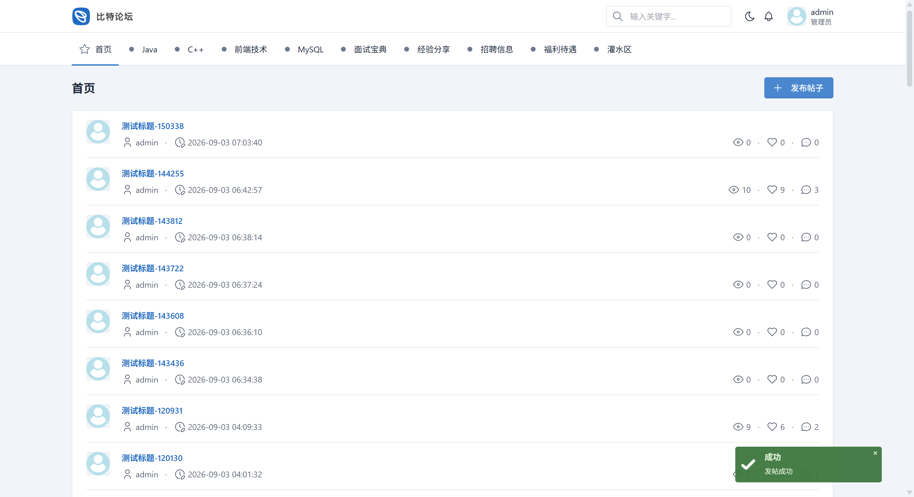

```
测试场景五：编辑自己的帖子（闭环验证）
```
> 预期结果：编辑页加载原文 → 修改标题和内容 → 保存成功 → 重新进入详情页验证修改已生效
> 实际结果：保存提示成功，回列表重新进入详情页，标题/内容均为修改后的值，闭环通过

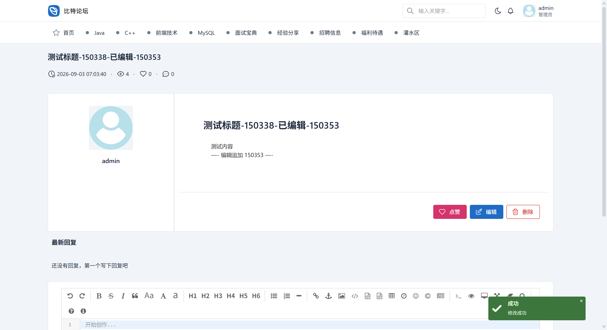

```
测试场景六：删除自己的帖子（闭环验证）
```
> 预期结果：弹出二次确认框，确认后提示"删除成功"，我的帖子列表中该帖子消失、条数 -1
> 实际结果：删除成功，列表条数 36 → 35 且被删标题不在列表；**【Bug】资料卡"发帖数"缓存未同步减少（数据实际已删除，不影响功能）**

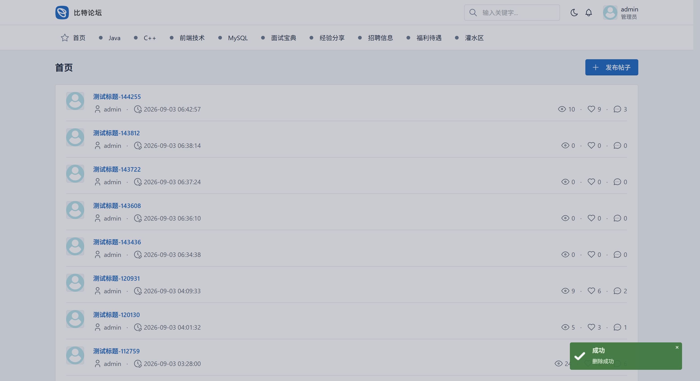

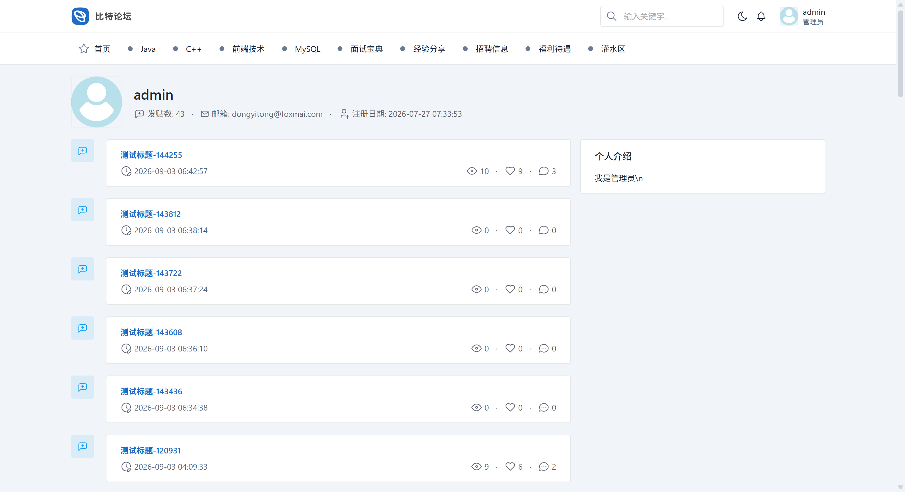

#### 2.7 个人中心界面

```
测试场景一：修改头像
```
> 预期结果：唤起文件对话框，选择图片后头像更新
> 实际结果：**【Bug】可唤起文件对话框，但选择图片后头像无任何变化、无提示，上传功能失效**

```
测试场景二：修改昵称/邮箱/手机号/个人简介
```
> 预期结果：可修改昵称/邮箱/手机号/简介并实时生效（昵称在导航栏同步变化）；填入与原值相同的内容时提示参数校验失败
> 实际结果：均可修改成功并实时生效（测完自动恢复原值）；相同值触发警告"参数校验失败"

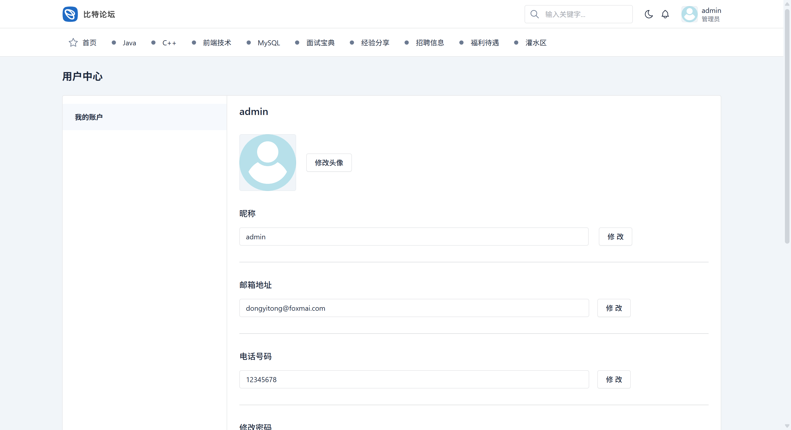

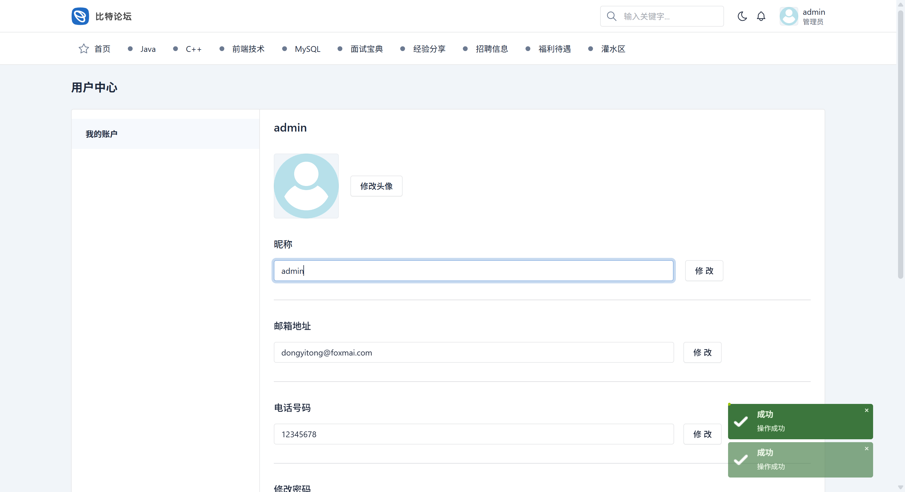

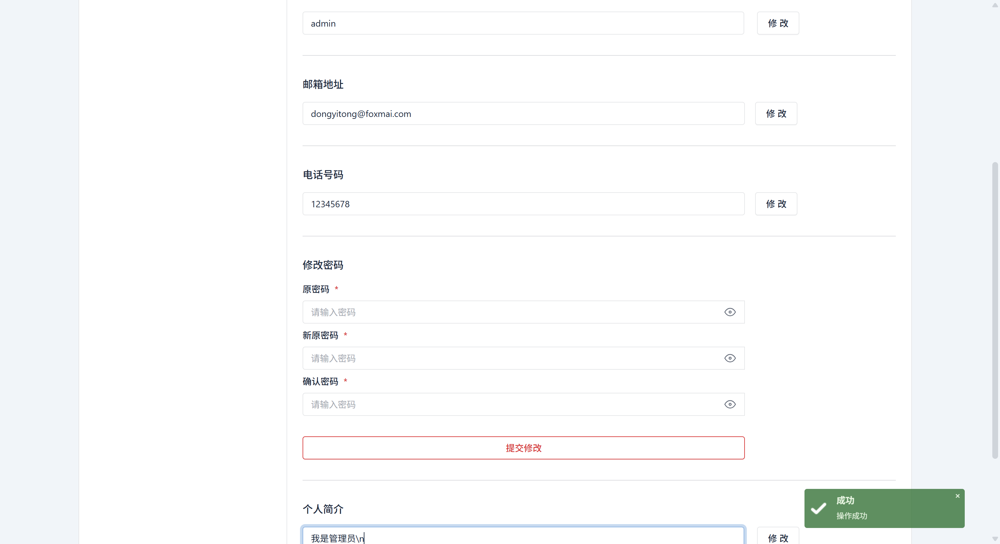

```
测试场景三：邮箱/手机号填入非法格式（如 newEmail、newPhone）
```
> 预期结果：格式校验不通过，保存被拒
> 实际结果：**【Bug】无格式校验，非法邮箱/手机号可直接保存成功**

```
测试场景四：修改密码——两次新密码不一致
```
> 预期结果：提示"两次输入的密码不相同"
> 实际结果：提示"两次输入的密码不相同"

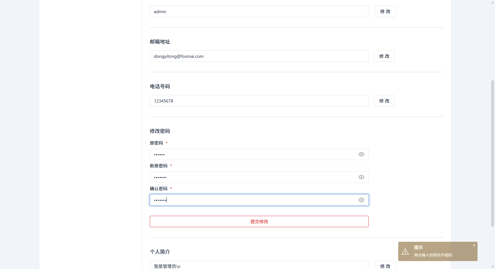

```
测试场景五：修改密码——原密码错误
```
> 预期结果：提示"参数校验失败"
> 实际结果：警告"参数校验失败"

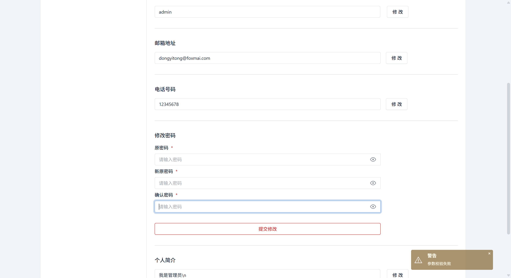

```
测试场景六：修改密码——正常流程
```
> 预期结果：修改成功后跳回登录页，旧密码无法登录、新密码可登录
> 实际结果：修改成功跳回登录页；旧密码 123456 登录被拒、新密码 a123456 登录成功；用例结束自动把密码改回 123456 恢复现场


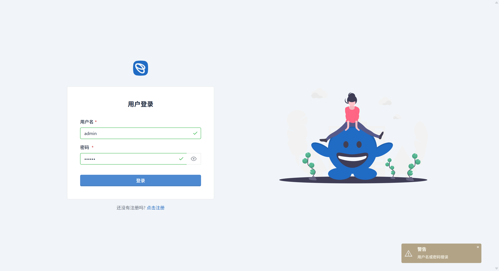


```
测试场景七：修改密码——新密码与旧密码相同 / 弱密码
```
> 预期结果：与旧密码相同应拒绝修改；弱密码应有强度提示
> 实际结果：**【Bug】相同密码也可修改成功；弱密码（如 123）同样可修改成功，无强度校验**

#### 2.8 站内信全流程

```
测试场景：test01 给 admin 发送私信 → admin 侧查看 → admin 回复 → test01 确认收到回信
```
> 预期结果：admin 铃铛出现未读小红点，收件箱显示未读状态与信件内容；回复后 test01 收到回信且状态为未读
> 实际结果：全流程通过——"test01 已向 admin 发送私信""未读 badge 显示""找到未读私信，状态[未读]""admin 已回复""test01 收到 admin 回信，状态[未读]"，结束自动恢复 admin 登录态

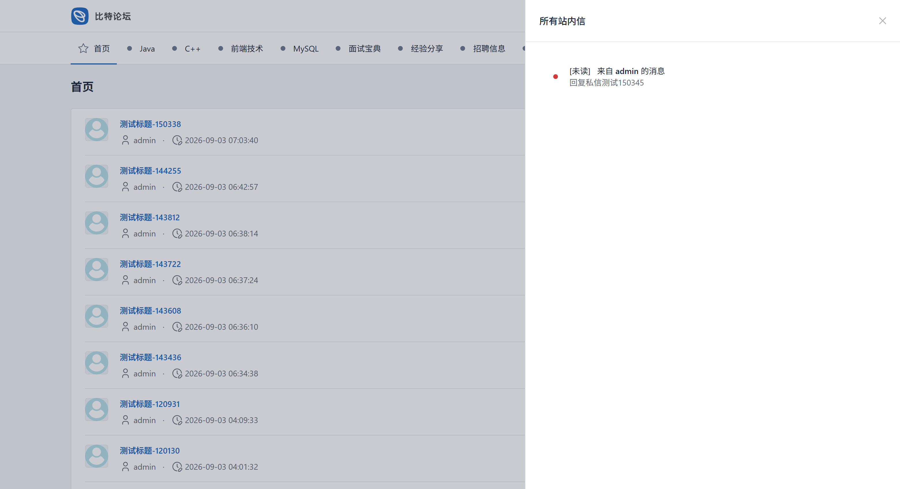

### 3. 安全测试

#### 3.1 SQL 注入测试

```
测试场景一：用户名输入 123'，密码随便输入
```
> 预期结果：提示用户名或密码错误，不发生注入
> 实际结果：提示"用户名或密码错误"

```
测试场景二：用户名输入 ' OR '1'='1，密码随便输入
```
> 预期结果：提示用户名或密码错误，不发生注入
> 实际结果：提示"用户名或密码错误"

> 测试结果：登录接口使用参数化查询，**不存在 SQL 注入漏洞**（两个场景均固化进自动化用例 `loginErrTest` case 6/10，每次回归）。

#### 3.2 XSS 注入测试

```
测试场景：在私信中输入  发送给对方
```
> 预期结果：对方查看时只显示纯文字，无弹窗，脚本不执行
> 实际结果：对方登录查看私信时**弹窗出现、看不到文字内容**

> 测试结果：**当前系统存在 XSS 注入风险**，私信/回复等用户输入内容未做 HTML 转义过滤。

> 自动化验证（`Security.xssTest`）：test01 发送含 `` payload 的私信给 admin，admin 登录进首页时未读消息预览即渲染 payload 触发 alert，`WebDriverWait(...).until(EC.alert_is_present())` 成功捕获并断言漏洞存在。每次回归自动复现。

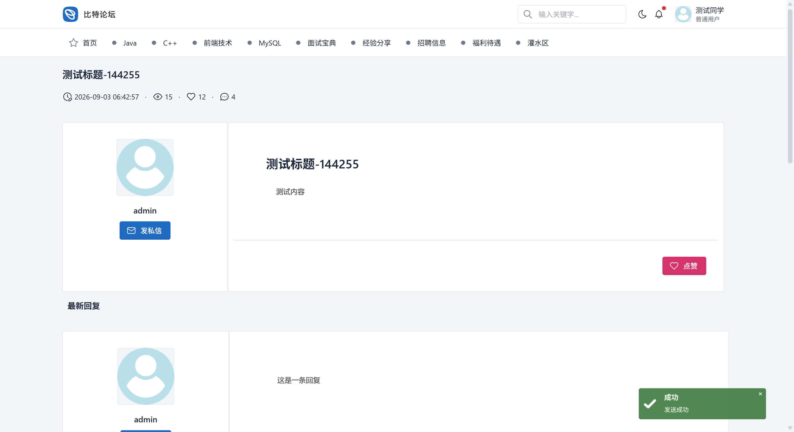

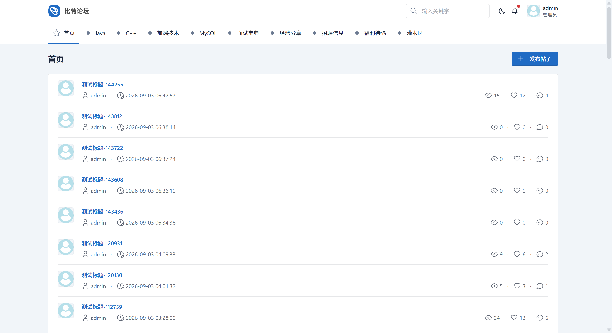

### 4. 兼容性测试

```
测试场景一：分别使用 Chrome、Edge、联想浏览器访问系统
```
> 预期结果：不同浏览器下界面均美观、功能正常
> 实际结果：三种浏览器显示均正常（自动化回归基准环境为 Chrome 151）

```
测试场景二：不同操作系统 / 移动端访问
```
> 预期结果：各系统下界面美观可用
> 实际结果：Windows 桌面端正常；**Android、iOS 移动端无法访问（系统无移动端适配）**

### 5. UI 自动化测试实施

本次测试核心产出为一套可重复执行的 Selenium UI 自动化框架，替代人工逐项点击：

```
ForumTest/
├── common/
│   ├── Utils.py        # 浏览器单例 ForumDriver、启动自动打印环境信息、
│   │                   # 截图按 images/日期/第N次测试/ 归档、toast 文案清洗
│   └── DBUtil.py       # 物理删除测试用户及其帖子/回复/站内信，保证用例可重复执行
├── tests/              # 8 个测试类(7 页面对象 + 1 安全测试) + RunTest.py 串行入口（42 条用例）
└── requirements.txt    # 依赖清单
```

框架关键机制（均为实际踩坑后沉淀，详见《测试用例编写指导.md》）：

1. **全程显式等待**（WebDriverWait + expected_conditions），禁止隐式等待与 sleep 混用；toast 用文本条件等待，避免残留提示误判。
2. **CodeMirror 富文本编辑器**通过 JS API（`cm.CodeMirror.setValue()`）操作；编辑页与详情页内容比对统一取 Markdown 渲染区，避免源码与渲染结果不一致。
3. **适配单页应用特性**：不使用浏览器刷新（会重置 SPA 路由），保存/删除后等列表渲染再重新进入详情页验证；计数变化在当前视图轮询 DOM。
4. **数据自恢复**：test01 用户每次运行前重建，admin 昵称/资料/密码用例结束自动还原，测试帖子即建即删、标题带时间戳防同名残留。
5. **日志结构化**：每个模块打印横幅、每条用例打印步骤行，失败时最后一条步骤行即出错用例；toast 统一清洗为单行输出。

**执行结果：42 条用例全部通过（pass 42/42，fail 0/42），可一键重复回归。**

运行方式：

```bash
pip install -r requirements.txt
python d:/test/ForumTest/tests/RunTest.py
```

## 三、Bug 描述

| 序号 | Bug 界面 | Bug 描述 | Bug 等级 | 发现方式 |
|:----:|----------|----------|:-------:|:----:|
| 1 | 论坛首页 | 搜索框无法搜索：输入框缺 name 属性、后端未按关键字过滤，回车后页面重载 | 严重 | 自动化 |
| 2 | 帖子详情页 | 无限刷赞：重复点击点赞计数持续 +1，无法取消点赞 | 严重 | 自动化/手工 |
| 3 | 登录界面 | 两个账号可同时登录，一方会话会覆盖另一方内容 | 严重 | 手工 |
| 4 | 帖子回复/私信 | 未防范 XSS 注入，私信内容触发弹窗，脚本被执行 | 严重 | 自动化 |
| 5 | 帖子回复界面 | 超长回复无长度校验，数据库 Data truncation 异常且原始 SQL 报错回显前端 | 一般 | 自动化 |
| 6 | 个人中心 | 修改头像功能失效：可唤起文件框但选择后头像无变化、无提示 | 一般 | 自动化 |
| 7 | 帖子详情页 | 无法删除自己发表的评论/回复 | 一般 | 手工 |
| 8 | 个人中心 | 邮箱、手机号无格式校验，非法内容可保存成功 | 一般 | 自动化 |
| 9 | 注册/个人中心 | 密码无强度校验，弱密码（123456、123）可注册/修改成功 | 一般 | 自动化 |
| 10 | 帖子详情页 | 回复评论的时间显示错误 | 轻微 | 手工 |
| 11 | 发布帖子界面 | 编辑/发布页返回上一级后需要重新登录 | 轻微 | 手工 |
| 12 | 个人中心 | 修改密码时填入与原密码相同也可修改成功 | 轻微 | 手工 |
| 13 | 我的帖子 | 删除帖子后资料卡"发帖数"未同步减少（列表已实际删除） | 轻微 | 自动化 |
| 14 | 注册界面 | 用户名含空格/特殊字符不拦截，可注册成功 | 轻微 | 自动化 |
| 15 | 个人中心 | 修改密码页小眼睛（明文查看密码）无法点击 | 轻微 | 手工 |

## 四、测试报告总结

本次针对论坛系统开展了功能测试、安全测试、兼容性测试及 UI 自动化测试，核心覆盖用户注册、登录、板块浏览、帖子发布/编辑/删除、回复与点赞、站内信、个人中心资料与密码管理等业务流程。**42 条自动化用例全部通过，主流程功能正常、数据闭环验证完整，且用例可一键重复回归**；测试中共发现 15 个缺陷（4 严重 / 5 一般 / 6 轻微），系统整体评定为**有条件通过**，建议修复严重缺陷并补充输入校验后回归。

改进建议：

1. 修复搜索功能：排查搜索接口逻辑与前端触发机制，为输入框补 name 属性，确保关键词精准匹配并展示相关帖子；
2. 优化点赞逻辑：增加点赞状态校验（同一用户对同一帖子仅可点赞一次，重复点击取消点赞），杜绝无限刷赞；
3. 完善登录态管理：增加账号登录互斥/会话校验，避免多账号同时登录导致数据覆盖；修复"返回上一级需重新登录"的会话保持问题；
4. 安全加固：对私信、回复等用户输入内容做 XSS 过滤与 HTML 特殊字符转义；注册环节补充用户名格式校验；
5. 补充输入校验：回复/发帖内容增加前后端长度校验（拦截超长内容，禁止数据库原始异常回显）；邮箱、手机号增加格式校验；密码增加强度校验并拒绝与旧密码相同；
6. 完善功能细节：补充评论删除逻辑与权限校验；修正回复时间戳显示；修复头像上传接口；优化删除帖子后资料卡计数的同步刷新；修复密码小眼睛按钮；
7. 持续维护自动化回归集：新增功能同步补充用例并登记 RunTest.py，缺陷修复后将对应"现状记录用例"转为正向断言用例。
